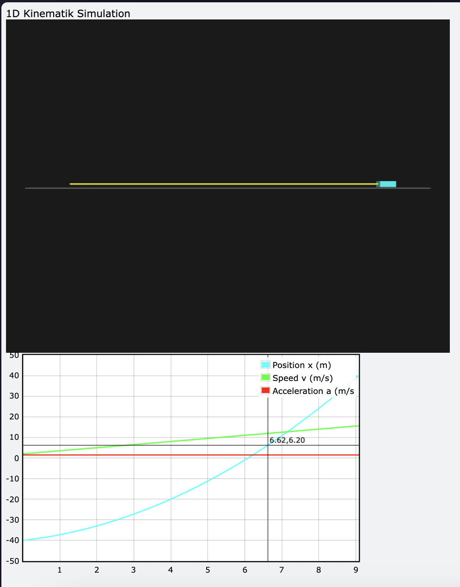

### Overview 
- this is a tiny python VPython kinematic 1D simulation 
- Formula: 
$$
x_2 = x_1 + v_avg\Delta t \rarr  (0m) + (0.45m/s) * (1.5s)
$$
- 
```python
 python3 -m venv .venv                     
 pip install VPython 
 source .venv/bin/activate 
.venv/bin/python -m pip install "setuptools<81"
```

> Screenshot from the simulation
### Resources
[Dot Physics](https://www.youtube.com/watch?v=PPIl6cirfhY&list=PLWFlMBumSLSaqgYlK2wD7XSPRQ2p-_Tl4)
